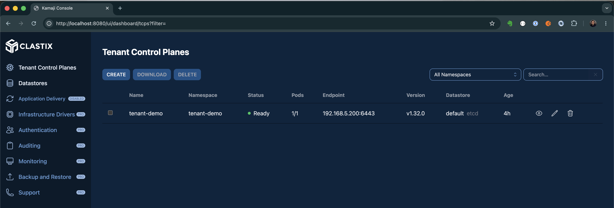

# Kamaji Platform Engineering Lab

> A fully validated guide to running a multi-tenant Kubernetes platform on macOS using Kamaji, Capsule, and Kamaji Console — built on kind (Kubernetes IN Docker).



---

## What This Is

A hands-on platform engineering lab that demonstrates:

- **Kamaji** — hosted control planes (TCP) running as pods
- **Capsule** — soft multi-tenancy with namespace quotas, RBAC delegation, and policy enforcement
- **Kamaji Console** — web dashboard for managing tenant control planes
- **Kind** — management cluster running in Docker (no VMs needed)
- **Docker container workers** — worker nodes in the same Docker network as the management cluster

Every step was validated on macOS M3 with Apple Silicon. All errors encountered are documented in the known issues section.

---

## Architecture

```
macOS M3
  └── Docker Desktop
        ├── kind cluster: kamaji-mgmt
        │     ├── Kamaji Operator + etcd (3-node)
        │     ├── MetalLB (172.18.255.200-250)
        │     ├── cert-manager
        │     ├── Gateway API CRDs
        │     └── Kamaji Console
        │
        └── Docker container: kamaji-worker-01
              └── kubelet → TenantControlPlane (tenant-demo)
                    ├── Flannel CNI
                    ├── CoreDNS
                    └── konnectivity-agent

Tenant cluster access: kubectl port-forward :7443 → 172.18.255.200:6443
```

---

## Quick Start

```bash
git clone https://github.com/simonjday/kamaji-lab
cd kamaji-lab
chmod +x scripts/*.sh

# 1. Create management cluster
./scripts/setup-kind-kamaji.sh

# 2. Create tenant control plane
export KUBECONFIG=~/.kube/config
kubectl create namespace tenant-demo
kubectl apply -f manifests/tenants/tenant-demo.yaml
kubectl get tcp -n tenant-demo -w

# 3. Join worker node
./scripts/setup-worker-kind.sh tenant-demo tenant-demo

# 4. Source shell helpers
echo 'source "$(pwd)/scripts/shell-helpers.zsh"' >> ~/.zshrc
source ~/.zshrc

# Switch between clusters
use-mgmt                  # management cluster
use-tenant tenant-demo    # tenant cluster (starts port-forward)

# 5. Install Capsule (multi-tenancy)
./scripts/setup-capsule.sh

# 6. Install Kamaji Console (web UI)
./scripts/setup-kamaji-console.sh
kamaji-ui
```

---

## Documentation

Full guide including architecture, manual steps, known issues and Capsule demo:

📄 [docs/kamaji-overview.md](docs/kamaji-overview.md)

## Tested On

| Component | Version |
|---|---|
| macOS | 15 (Apple M3) |
| Docker Desktop | 4.x |
| kind | v0.20+ |
| Management cluster K8s | v1.34.0 |
| Kamaji | latest |
| Kamaji Console | v0.2.1 |
| Tenant K8s version | v1.30.2 |
| Capsule | v0.13.0 |
| cert-manager | v1.20.2 |
| MetalLB | v0.15.3 |
| Flannel | latest |
| CNI plugins | v1.5.1 |

---

## Scripts

| Script | Purpose |
|---|---|
| `setup-kind-kamaji.sh` | Create kind cluster + MetalLB + cert-manager + Gateway API CRDs + Kamaji |
| `setup-worker-kind.sh` | Create Docker container worker and join to TCP |
| `setup-capsule.sh` | Install cert-manager + Capsule on tenant cluster + demo tenants |
| `setup-kamaji-console.sh` | Install Kamaji Console on management cluster |
| `shell-helpers.zsh` | `use-mgmt`, `use-tenant`, `kamaji-ui`, `kamaji-status` |

---

## Shell Helpers

After sourcing `scripts/shell-helpers.zsh`:

```bash
use-mgmt                    # switch to management cluster
use-tenant tenant-demo      # switch to tenant (starts port-forward)
kamaji-status               # TCP list + pod health
kamaji-ui                   # open Kamaji Console in browser
reset-tenant tenant-demo    # clear kubeconfig cache
```

---

## Capsule Multi-Tenancy Demo

```bash
use-tenant tenant-demo

# Create tenant
kubectl apply -f manifests/capsule/team-alpha.yaml
kubectl apply -f manifests/capsule/team-beta.yaml

# Alice creates namespaces (quota: 3, prefix enforced)
kubectl --as=alice --as-group=projectcapsule.dev create namespace team-alpha-frontend
kubectl --as=alice --as-group=projectcapsule.dev create namespace team-alpha-backend
kubectl --as=alice --as-group=projectcapsule.dev create namespace team-alpha-data

# 4th namespace blocked
kubectl --as=alice --as-group=projectcapsule.dev create namespace team-alpha-overflow
# Error: Cannot exceed Namespace quota

# Bob's namespaces isolated from Alice's
kubectl --as=bob --as-group=projectcapsule.dev get pods -n team-alpha-frontend
# Error: Forbidden
```

---

## Known Issues

See **Section 10** of `docs/kamaji-overview.md` for the full table of every error encountered, with causes and fixes.

Key highlights:
- Gateway API experimental CRDs must be installed before Kamaji
- Use `v1.30.2` for TCP K8s version (Kamaji validates against management cluster version)
- Worker nodes are Docker containers — use `kindest/node:v1.30.2`
- kubelet requires manual bootstrap config, swap flag, and kube-proxy kubeconfig
- Capsule requires `forceTenantPrefix: true` for quota enforcement
- Capsule webhook group is `projectcapsule.dev` not `capsule.clastix.io`

---

## References

- [Kamaji docs](https://kamaji.clastix.io)
- [Kamaji kind guide](https://github.com/clastix/kamaji/blob/master/docs/content/getting-started/kamaji-kind.md)
- [Capsule docs](https://projectcapsule.dev)
- [MetalLB](https://metallb.universe.tf)

---

## Author

Simon Day | Platform & DevOps Engineer  
Kubernetes, GitOps, Confluent Platform  

*Built on macOS M3, May 2026.*
